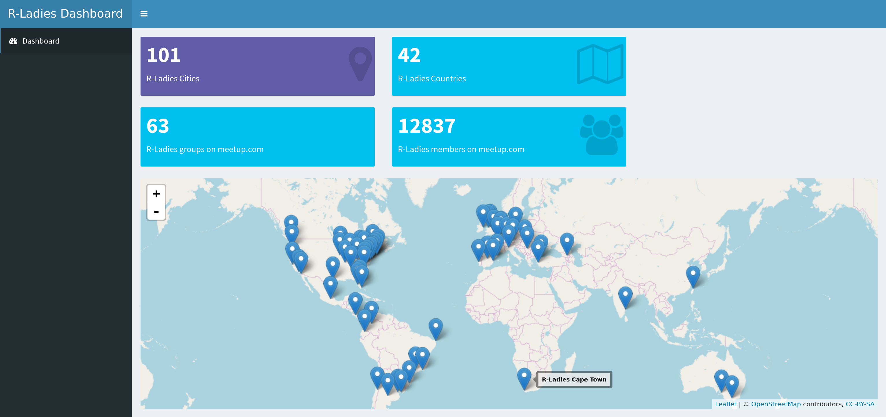

# rshinylady

Before running this app, install meetupr package

```r
devtools::install_github("rladies/meetupr")`
```

then get a meetup API key and set it as an environmental variable

```r
Sys.setenv(MEETUP_KEY = "YOUR_API_KEY_HERE")`
```

The result should look like the screenshot below.




### App is deployed at: 

[https://gqueiroz.shinyapps.io/rshinylady/](https://gqueiroz.shinyapps.io/rshinylady/)
